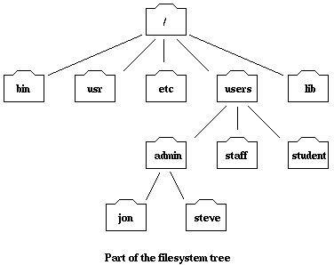

# Working with Jupyter Lab and terminal

---

Share desktop with jupyter lab/conda. 

* we are mainly going to be working with python
* there are a few tools that we will use to help us do this: 
* `conda`: which helps us keep our code organized and ensures that things work well together
* and `Jupyterlab`, or jupyter notebooks, which are the interfaces we will use to write and run code.
* just two of many choices, but particularly good ones

## open jupyterlab via conda:
1. let me share my screen. this might automatically go to full screen for you, so press escape to get out of that so you can follow along
1. open a terminal or anaconda power-shell
1. If you've properly setup your environment type conda activate swbc2023
1. select `swbc` from the `applications on` drop down (hopefully people created this ...)
	* the `swbc` is an environment that keeps all our code for this class together, and from messing up other code
1. `launch` jupyterlab
1. let me adjust my screenshare so that it only takes up half the screen
1. arrange your windows side by side (suggestion) so that you see mine and yours at the same time

## overview of the jupyter lab environment.

* Jupyterlab is a webbrowser-based inteface for data analysis and all sorts of tools
* it looks like a website, but its just using your browser as a display, you could run this with no internet connection
* JupyterLab enables you to work with documents, data files, and interactive tools like Jupyter notebooks, text editors, terminals, 
* click through the file browser to get to the folder with our first section in it
* open: pdf from lecture notes, csv datafile from data,
* can toggle the file browswer on the left on and off
* can arrainge multiple windows as tabs or side-by-side
* click the `+` to get a launcher tab to see options for programs and files you can use in jupyter
* include stuff like python, R, (other code languages), text files, and command terminals

---- 
----

# Shell / terminal basics
open a terminal

---

**Mention**: While the shell is something very useful to learn in its own right, elements of the way shells work appear in python and many other places. In python we load files from a location in the same way that you would in the shell. So it really helps to have an idea of how this works, and what it all represents. 

---

At a high level, computers do four things:

* run programs
* store data
* communicate with each other, and
* interact with us
	* Graphical User Interface (GUI)
	* Command Line Interface (CLI)

The terminal we are looking at, which are a little differnt on mac's and pc's is called a `shell`

The Shell is a program which runs other programs rather than doing calculations itself. Those programs can be as complicated as climate modeling software and as simple as a program that creates a new directory. 

Why do we learn to use the shell?

* Allows users to automate repetitive tasks
* And capture small data manipulation steps that are normally not recorded to make research reproducible [what does reproducible mean to you?]
* Allows us to work ‘programatically’ with servers and other remote machines

if someone is struggling, can use binder to get a unix shell here: https://notebooks.gesis.org/binder/jupyter/user/carpentries-scaffolds-kypdidgm/lab

### Navigating Files and Directories

Several commands are frequently used to create, inspect, rename, and delete files and directories.

To find out your username in general, you can use the command

`$ whoami`

Next, let’s find out where we are by running a command called pwd (which stands for “print working directory”). At any moment, our current working directory is our current default directory, i.e., the directory that the computer assumes we want to run commands in unless we explicitly specify something else. 

` $ pwd`

To understand where you are, let’s have a look at how the file system as a whole is organized. For the sake of this example, we’ll be illustrating the filesystem on a unix computer. After this illustration, you’ll be learning commands to explore your own filesystem, which will be constructed in a similar way, but not be exactly identical.

On a Unix computer, the filesystem looks like something this:

At the top is the root directory that holds everything else. We refer to it using a slash character / on its own; this is the leading slash in /home/jovyan.

Now let’s learn the command that will let us see the contents of our own filesystem. We can see what’s in our home directory by running `ls`, which stands for “listing”:

`$ ls`

`ls` prints the names of the files and directories in the current directory in alphabetical order

on a mac of unix system you can use `ls -F` to see more info about things. This probably won't work for those of you on a pc

if something in the list is followed by a slash `/` that means its a directory, or folder, otherwise it's a file or perhaps a program

The command to change locations is `cd` followed by a directory name to change our working directory. `cd` stands for “change directory”, which is a bit misleading: the command doesn’t change the directory, it changes the shell’s idea of what directory we are in.

`$ `

Are we all in our swbc directory?

Let’s say we want to move to a directory. we can say 
`$ cd whereever`

and `pwd` and `ls` to see where we are and whats in there

We now know how to go down the directory tree, but how do we go up?
There is a shortcut in the shell to move up one directory level that looks like this:

`$ cd ..` 

We call the address of some file of directory the `path`, so when you type `pwd` the thing that gets spit out is the path. 

Actually, we call that thing the `absolute path` because it tells you where you are all the way from the root of the filesystem.

We also can refer to a directory by a `relative path`, which is just the address relative to where we are now. 

For example `..` is a relative path, its the adress of the folder above me relative to where i am now

In the schematic of the file system, pretend you are in the student directory and you want the absolute path, what command do you use? what would the absolute path look like?

`pwd`

`/users/student`

if you were in the staff directory and you wanted the address of the student directory you could write out the absoulte path, but could also write a relative path, what would that be?

`../student`

what about the relative path from staff to steve?

`../admin/steve`

Why are we doing this? one basic reason is that I want to get you thinking about how a computer is structured so that we can write code that accesses data and files in different places around the computer

### Working with Files and Directories

Just a couple of useful commands for working with directories

there is so much more you can do with the shell! but we are just going to use a few commands to navigate for now

you can create a new directory at the command line using `mkdir` which sort of looks like make-DIRectory

`$ mkdir great_stuff_in_here`

`$ cd great_stuff_in_here`

Tab completion is GREAT. Helps complete long names. 

### Good names for files and directories

Complicated names of files and directories can make your life painful when working on the command line. Here we provide a few useful tips for the names of your files.

1. Don’t use whitespaces.
	Whitespaces can make a name more meaningful but since whitespace is used to break arguments on the command line is better to avoid them on name of files and directories. You can use - or _ instead of whitespace.

1. Don’t begin the name with - (dash).
	Commands treat names starting with - as options.

1. Stick with letters, numbers, . (period), - (dash) and _ (underscore).
	Many other characters have special meanings on the command line. We will learn about some of these during this lesson. There are special characters that can cause your command to not work as expected and can even result in data loss.

# Break??

# Reiterate the importance of file structure 

* navigate a file system (useful for remote computers)
* understand how a programming language 'thinks' about files (useful for python later)

# Roadmap
* start with basic python, 
* then walk through some powerful python tools for loading, handling, and visualizing data. 
* then how to make maps. 
* then circle back to some advanced analysis pipelines and methods using our tools.

## python notebooks
**open a new notebook, show some stuff before you open your empty notebook**

* notebooks works with the framework of cells, each cells contains its own content, but in the context of the other cells in a notebook.

* lots of ways to run code in python, I am going to teach you one, but its' good to know eventually that there are many options, none of them change the underlying code which is just a plan text file with instructions for the computer.

